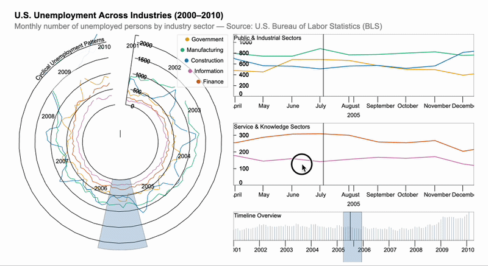

# time-i-gram

[)](https://www.npmjs.com/package/@vanessa_stoiber1999/time-i-gram)
[](LICENSE.md)

**time-i-gram: A Grammar for Interactive Visualization of Time-based Data**


## Overview

**time-i-gram** is a grammar-based toolkit for creating scalable and interactive visualizations of **time-based data**. It extends [Gosling.js](https://github.com/gosling-lang/gosling.js), a grammar originally designed for genomics data visualization, by introducing first-class support for temporal data types, time-aware data fetchers, and a Unix time axis track.

With time-i-gram, users can declaratively specify rich, interactive time-series visualizations using a concise JSON specification, including features such as coordinated multiple views, semantic zooming, brushing & linking, and responsive layouts.

>  **[Observable Demo](https://observablehq.com/d/226caaa8a69fc9d3)**

---

## Key Features

### Temporal Data Type
A new `"temporal"` field type for encoding time on the `x` axis (also `xe`, `x1`, `x1e`), alongside the existing `"genomic"`, `"quantitative"`, and `"nominal"` types. Temporal `y` axes are not supported.

```jsonc
{
  "x": { "field": "date", "type": "temporal", "axis": "bottom" }
}
```

### Time-aware Data Sources
Two new data source types for loading time-based datasets:

| Type | Description |
|---|---|
| `csv-time` | Load temporal data from CSV files with automatic date field parsing |
| `json-time` | Load temporal data from inline JSON values or remote JSON URLs |

Both support `dateFields` (for human-readable dates), `timestampField` (for Unix timestamps), and `interval` (for time ranges).

```jsonc
{
  "data": {
    "url": "https://example.com/weather.csv",
    "type": "csv-time",
    "dateFields": ["date"]
  }
}
```

### Unix Time Axis Track
A dedicated axis track that renders human-readable time labels (years, months, days, hours, etc.) with automatic tick formatting that adapts to the current zoom level.

### Time Coordinate Systems

Every temporal x axis has a **time coordinate system**, which decides where a time is placed, how the axis is labeled, and which views can be linked:

| System | Syntax (on `x`) | A time is placed at | Axis labels |
|---|---|---|---|
| absolute (default) | — | its instant (Unix seconds) | dates |
| period | `period: "year" \| "month" \| "week" \| "day"` or `{ unit, weekBased?, start?, newField? }` | its position within its calendar period, so all periods share one axis (or one revolution in a circular layout) | `Jan`…`Dec`, `W1`…`W53`, `Mon`…`Sun`, `00:00`…`23:00` |
| relative | `relative: { anchor, groupby?, unit? }` | its signed offset from a reference event | `−2 wk`, `0`, `+3 wk` |

```jsonc
// every year on one ring, ISO week 1 at 12 o'clock; each row's year goes to the field "year"
"x": { "field": "date", "type": "temporal", "period": { "unit": "year", "weekBased": true, "newField": "year" } },
"color": { "field": "year", "type": "nominal" }   // or "row" for one concentric ring per year

// flu seasons (ISO week 40 to 39) aligned to their own peak
"x": { "field": "date", "type": "temporal",
       "relative": { "anchor": { "argmax": "cases" },
                     "groupby": { "period": { "unit": "year", "weekBased": true, "start": 40, "newField": "season" } },
                     "unit": "week" },
       "domain": { "interval": ["-16 weeks", "16 weeks"] } }
```

- **Period.** Years align by calendar date in a leap reference year; `weekBased` uses ISO week-years; `start` begins each period at another month, ISO week, weekday, or hour (e.g. August–July seasons). Intervals (`x`/`xe`) that cross a period boundary are split. A `domain` on a period axis is ignored (the whole period is shown).
- **Relative.** `anchor` is a date, `"first"`, `"last"`, `{ "argmax": field }`, `{ "argmin": field }` (per `groupby` group), or `{ "field": name }` (per row). Set the domain as offsets (durations or seconds). `label` names the event in the axis title (e.g. `"the season's peak"` gives "weeks from the season's peak").
- **Linking.** Views are linked (`linkingId`, brushes) only within one coordinate system: a position within a period stands for many absolute instants. A `linkingId` that joins views in different systems is split into one link per system, whatever the order of the views, with a warning; a view alone in its system is not linked.

### Calendar Granularity

```jsonc
// date strings in domains (a partial date as the end includes the whole unit) and durations
"xDomain": { "interval": ["2000-01", "2010-12"] },
"zoomLimits": ["1 hour", "20 years"],
"visibility": [{ "measure": "zoomLevel", "operation": "lt", "threshold": "3 months", "target": "track" }],

// "show by month": truncate to the unit and aggregate per unit and nominal channel field
"x": { "field": "date", "type": "temporal", "timeUnit": "month" },
"y": { "field": "rate", "type": "quantitative", "aggregate": "mean" },   // count, sum, mean, median, min, max
"color": { "field": "series", "type": "nominal" },

// granularity transition rules: daily below 3 months of visible time, monthly above
"x": { "field": "date", "type": "temporal",
       "timeUnit": [{ "unit": "day", "maxSpan": "3 months" }, { "unit": "month" }] }
```

- **Units:** `millisecond`, `second`, `minute`, `hour`, `day`, `week` (ISO, Monday–Sunday), `month`, `quarter`, `year`, `decade`, all in UTC.
- **Durations:** `"<number> <unit>"`, e.g. `"90 minutes"`, `"2 weeks"`, `"-36 mo"`; a month is 30.44 days, a year 365.2425 days.
- **Aggregation is exact under tiling:** the time data fetchers give each unit to the tile that contains its start.
- **Granularity rules** are shorthand for overlaid copies of the track, one per unit, with `visibility` conditions on the zoom level.
- **Edge units:** a unit at the edge of the data is aggregated from the rows present (e.g. a yearly mean of January and February only), so end a domain on whole units where that matters.

### Time Transforms

| Transform | Does |
|---|---|
| `{ "type": "timeUnit", "field", "unit", "newField"?, "endField"? }` | truncates a time field to the start (and end) of its unit |
| `{ "type": "span", "field", "duration", "unit"?, "newField" }` | adds a duration (a numeric field in `unit`, or a literal such as `"15 minutes"`) to a start time: an interval for `x`/`xe` |

### Titles, Axes and Legends of Temporal Tracks

Linear tracks on a temporal axis keep a header strip at the top for the track title, the y-axis title and a one-line legend, so that none of them covers the axis or the data. On rings, the y-axis title and the legend go in the center when they fit.

```jsonc
"y": { "field": "INF_A", "type": "quantitative", "title": "Cases per week" },          // drawn as "↑ Cases per week"
"color": { "field": "year", "type": "nominal", "legend": true, "title": "Year" },
// a track with a constant color in the legend (e.g. bars vs line in an overlay)
"tracks": [
  { "mark": "bar", "color": { "value": "#f28e2b" }, "style": { "legendTitle": "Daily", "legendLabel": "Steps (bars)" } },
  { "mark": "line", "color": { "value": "black" }, "style": { "legendLabel": "Very active minutes (line)" } }
]
```

Time axes use 24-hour times and short month names, choose the number of ticks from their length, and name the visible range under the ticks (e.g. "2016 Feb 3, 12:35–13:35").

### Compiled Specs

The compiled spec (the editor's compiled view, and the track specs of the JavaScript API) contains internal names that the temporal grammar adds:
- **Coordinate fields:** `x.field` is rewritten to the coordinate field that a period or relative axis is drawn on (`__period_date`, `__relative_date`), or to a time unit's start (`__month_date`).
- **Internal properties:** tracks carry `_timeCoordinates`, `_timeUnit`, `_timeUnitTiling`, `_temporalResolved` and, on linear temporal tracks, `_headerHeight` / `_header`.

Read the fields of your data (e.g. in tooltips) from your spec, not from the compiled one.

Editor examples under **Temporal Data**: *Period: WHO Flu by Week of the Year*, *Period: FitBit Weekly and Daily Cycles*, *Granularity: Unemployment by Month or Year (zoom)*, *Relative: Flu Seasons and Unemployment Aligned to Events*, *Spans: NYC Taxi Trips and the Daily Cycle*.

### All Gosling.js Features
time-i-gram inherits the full power of Gosling.js, including:

- **Visual Marks**: `point`, `line`, `area`, `bar`, `rect`, `text`, `rule`, `link`, `triangle`, and more
- **Layouts**: Linear and circular
- **Coordinated Multiple Views**: Linking, brushing, and overview+detail
- **Semantic Zooming**: Dynamically changing visual representations at different zoom levels
- **Responsive Visualization**: Adapting to screen/container size
- **Theming**: Customizable visual styles
- **JavaScript API**: Programmatic control and event subscriptions

---

## Installation

### npm

```bash
# Install the embed package
npm install @vanessa_stoiber1999/time-i-gram
```

### Peer Dependencies

time-i-gram requires the following peer dependencies:

```bash
npm install pixi.js@^6.3.0 react@^18.0.0 react-dom@^18.0.0
```

---

## Quick Start

### Using the React Component

```tsx
import { GoslingComponent } from 'gosling.js';

const spec = {
  title: 'Seattle Weather',
  tracks: [{
    data: {
      url: 'https://raw.githubusercontent.com/vega/vega/main/docs/data/seattle-weather.csv',
      type: 'csv-time',
      dateFields: ['date']
    },
    mark: 'bar',
    x: { field: 'date', type: 'temporal', axis: 'bottom', domain: { interval: [1325376000, 1451606400] } }, // 2012-2015 in Unix seconds
    y: { field: 'precipitation', type: 'quantitative' },
    width: 800,
    height: 200
  }]
};

function App() {
  return <GoslingComponent spec={spec} />;
}
```

### Using the Embed API

```js
import { embed } from '@vanessa_stoiber1999/time-i-gram';

const spec = { /* your time-i-gram spec */ };

// Embed in a DOM element
embed(document.getElementById('container'), spec);
```

### Using in Observable Notebooks

```js
embed = {
  const mod = await import('https://cdn.jsdelivr.net/npm/@vanessa_stoiber1999/time-i-gram');
  return mod.embed;
}
```

---

## Usage Example

### U.S. Unemployment Across Industries — Circular Overview + Linked Detail

A multi-view dashboard combining a **circular overview** (left) with **linked detail panels** (right) for exploring U.S. unemployment across five industry sectors (2000–2010). Brushing on the circular view or the timeline bar filters all detail panels via coordinated linking.


```js
import { embed } from '@vanessa_stoiber1999/time-i-gram';

const CSV_URL =
  "https://raw.githubusercontent.com/denisseram/time-i-gram/14a22f2e66006df8a8498e2c0d6f992c5b49a810/unemployment-across-industries.csv";

const baseData = {
  type: "csv-time",
  url: CSV_URL,
  separator: ",",
  dateFields: ["date"],
  sampleLength: 2000
};

const timeDomain = { interval: [946713600, 1293782400] };
const industries = ["Government", "Manufacturing", "Construction", "Information", "Finance"];

// Helper: create an area + line overlay for one industry
function industryTracks(series, width, height) {
  return [
    {
      data: { ...baseData },
      dataTransform: [{ type: "filter", field: "series", oneOf: [series] }],
      x: { field: "date", type: "temporal", axis: "bottom", domain: timeDomain, linkingId: "detail-link" },
      y: { field: "count", type: "quantitative", axis: "left" },
      color: { field: "series", type: "nominal", domain: industries },
      mark: "area",
      opacity: { value: 0.3 },
      width,
      height,
      style: { outline: "none" }
    },
    {
      data: { ...baseData },
      dataTransform: [{ type: "filter", field: "series", oneOf: [series] }],
      x: { field: "date", type: "temporal", axis: "bottom", domain: timeDomain, linkingId: "detail-link" },
      y: { field: "count", type: "quantitative", axis: "left" },
      color: { field: "series", type: "nominal", domain: industries },
      mark: "line",
      size: { value: 1.5 },
      width,
      height,
      style: { outline: "none" }
    }
  ];
}

const spec = {
  title: "U.S. Unemployment Across Industries (2000–2010)",
  subtitle: "Monthly number of unemployed persons by industry sector — Source: U.S. Bureau of Labor Statistics (BLS)",
  arrangement: "horizontal",
  views: [
    // ── LEFT: Circular overview with brush ──
    {
      layout: "circular",
      title: "Cyclical Unemployment Patterns",
      subtitle: "Each ring shows the monthly unemployment count for one industry — drag the brush to zoom into a period",
      centerRadius: 0.35,
      alignment: "overlay",
      width: 450,
      height: 450,
      tracks: [
        ...industries.map((s) => ({
          data: { ...baseData },
          dataTransform: [{ type: "filter", field: "series", oneOf: [s] }],
          x: { field: "date", type: "temporal", axis: "top", domain: timeDomain },
          y: { field: "count", type: "quantitative", axis: "right" },
          color: { field: "series", type: "nominal", domain: industries, legend: true },
          mark: "line",
          width: 450,
          height: 450,
          style: { outline: "none" }
        })),
        { mark: "brush", x: { linkingId: "detail-link" }, color: { value: "steelBlue" } }
      ]
    },
    // ── RIGHT: Detail panels stacked vertically ──
    {
      arrangement: "vertical",
      views: [
        {
          title: "Public & Industrial Sectors",
          subtitle: "Monthly unemployed persons (thousands) in Government, Manufacturing, and Construction",
          alignment: "overlay",
          width: 500,
          height: 130,
          tracks: ["Government", "Manufacturing", "Construction"].flatMap((s) => industryTracks(s, 500, 130))
        },
        {
          title: "Service & Knowledge Sectors",
          subtitle: "Monthly unemployed persons (thousands) in Information and Finance",
          alignment: "overlay",
          width: 500,
          height: 130,
          tracks: ["Information", "Finance"].flatMap((s) => industryTracks(s, 500, 130))
        },
        {
          title: "Timeline Overview",
          subtitle: "Aggregate unemployment count — drag to select a time window",
          alignment: "overlay",
          width: 500,
          height: 60,
          tracks: [
            {
              data: { ...baseData },
              x: { field: "date", type: "temporal", axis: "bottom", domain: timeDomain },
              y: { field: "count", type: "quantitative", axis: "none" },
              color: { value: "#94a3b8" },
              mark: "bar",
              width: 500,
              height: 60,
              style: { outline: "none" }
            },
            { mark: "brush", x: { linkingId: "detail-link" }, color: { value: "steelBlue" } }
          ]
        }
      ]
    }
  ]
};

embed(document.getElementById("container"), spec);
```




---

## Development

### Prerequisites

- [Node.js](https://nodejs.org/) (v16+)
- [Yarn](https://yarnpkg.com/getting-started/install) (used instead of npm)

### Getting Started

```bash
# Clone the repository
git clone https://github.com/vanessastoiber/time-i-gram.git
cd time-i-gram

# Install dependencies
yarn

# Start the development editor
yarn start
```

Then open [http://localhost:3000/](http://localhost:3000/) in your browser to explore the interactive editor with built-in examples.

## API

time-i-gram exposes the same API as Gosling.js:

```ts
import { GoslingComponent, compile, validateGoslingSpec, embed, init } from 'gosling.js';
```

| Export | Description |
|---|---|
| `GoslingComponent` | React component for rendering visualizations |
| `embed` | Embed a visualization into a DOM element |
| `compile` | Compile a Gosling spec into a HiGlass spec |
| `validateGoslingSpec` | Validate a specification against the schema |
| `init` | Register all track plugins and data fetchers (called automatically) |
| `GoslingSchema` | The JSON schema for validation |

---

## Built On

time-i-gram is built on top of these excellent projects:

- [Gosling.js](https://github.com/gosling-lang/gosling.js) — Grammar-based genomics visualization toolkit
- [HiGlass](https://github.com/higlass/higlass) — Fast multi-scale visualization engine
- [PixiJS](https://pixijs.com/) — 2D rendering engine
- [D3.js](https://d3js.org/) — Data-driven documents
- [React](https://react.dev/) — UI component library

---

## Citation

If you use time-i-gram in your research, please cite:

> V. Stoiber, N. Gehlenborg, W. Aigner, and M. Streit, "time-i-gram: A Grammar for Interactive Visualization of Time-based Data," *Center for Open Science*, 2024. doi: [10.31219/osf.io/m9ubg](https://doi.org/10.31219/osf.io/m9ubg)

```bibtex
@article{Stoiber2024,
  title     = {time-i-gram: A Grammar for Interactive Visualization of Time-based Data},
  url       = {http://dx.doi.org/10.31219/osf.io/m9ubg},
  DOI       = {10.31219/osf.io/m9ubg},
  publisher = {Center for Open Science},
  author    = {Stoiber, Vanessa and Gehlenborg, Nils and Aigner, Wolfgang and Streit, Marc},
  year      = {2024},
  month     = may
}
```

This work extends Gosling.js, which can be cited as:

> S. L'Yi, Q. Wang, F. Lekschas, and N. Gehlenborg, "Gosling: A Grammar-based Toolkit for Scalable and Interactive Genomics Data Visualization," *IEEE Transactions on Visualization and Computer Graphics*, 2022. doi: [10.1109/TVCG.2021.3114876](https://doi.org/10.1109/TVCG.2021.3114876)

```bibtex
@article{LYi2022,
  title = {Gosling: A Grammar-based Toolkit for Scalable and Interactive Genomics Data Visualization},
  volume = {28},
  ISSN = {2160-9306},
  url = {http://dx.doi.org/10.1109/TVCG.2021.3114876},
  DOI = {10.1109/tvcg.2021.3114876},
  number = {1},
  journal = {IEEE Transactions on Visualization and Computer Graphics},
  publisher = {Institute of Electrical and Electronics Engineers (IEEE)},
  author = {LYi,  Sehi and Wang,  Qianwen and Lekschas,  Fritz and Gehlenborg,  Nils},
  year = {2022},
  month = jan,
  pages = {140–150}
}
```
