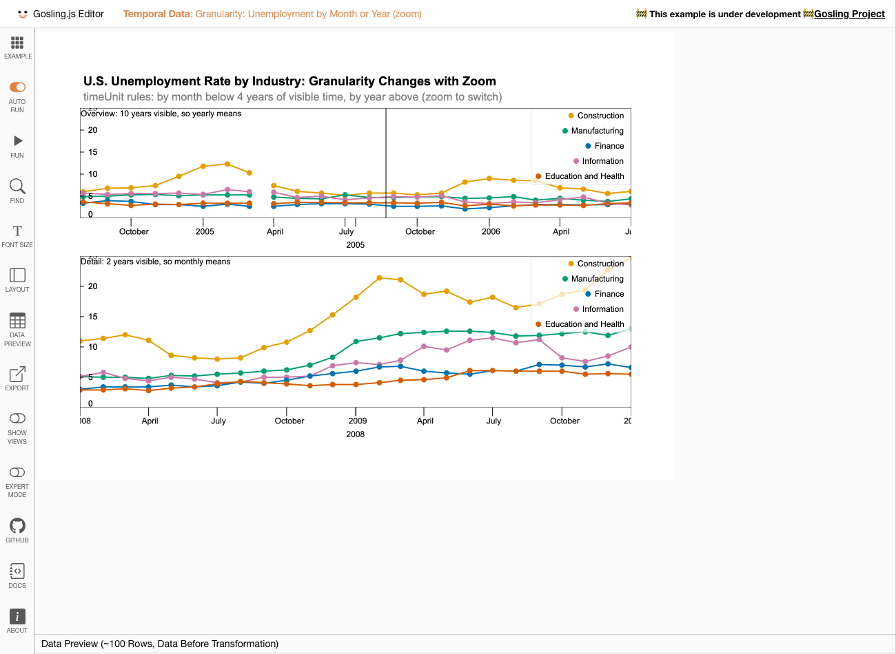

# Temporal grammar report: branch `feat/temporal-grammar`

Phase B of the temporal grammar work. The design (Phase A, approved) is in [temporal-grammar-design.md](temporal-grammar-design.md); this report covers what was built, where it differs from the design, and the evidence behind it.

**Result**
- All four features are implemented, in the requested order: granularity (1.1–1.4), period, relative, spans.
- Tile-exact aggregation (1.3) worked as planned, so the fallback to per-tile aggregation was not needed.
- Lines and areas no longer break at tile boundaries on temporal axes (your change request 4).

**Branch status**
- **Tests:** 379 pass, 0 fail (`npx vitest run`). The branch point (`fix/temporal-bugs`) had 229.
- **Types:** `npx tsc --noEmit` is clean.
- **Pushed:** both branches are on `denisseram`, and this time the pushes succeeded.
- **Genomic behavior unchanged:** eight genomic editor examples render pixel-identical to `fix/temporal-bugs`, or differ only by the run-to-run noise of the example itself (see Regression checks).

## The central abstraction: time coordinate systems

Every temporal x axis has a **time coordinate system**: `absolute` (default), `period` or `relative`. It is explicit in the code as the type `TimeCoordinateSystem` in [`src/core/utils/time-coordinate-system.ts`](../src/core/utils/time-coordinate-system.ts). The axis stays a linear scale over seconds; the coordinate system decides which seconds a time maps to. It determines three things:

1. **Where rows go.** `period` and `relative` map rows when the data is loaded, in the `csv-time` and `json-time` fetchers (`applyTimeCoordinates`). This happens before tiling, so HiGlass tiles, zoom, brushes and `visibility` work unchanged.
2. **How the axis is labeled.** The tick module [`time-axis-ticks.ts`](../src/tracks/unix-time-track/time-axis-ticks.ts) labels:
   - absolute axes with dates;
   - period axes with positions within the period (`Jan…Dec`, `W1…W53`, `Mon…Sun`, `00:00…23:00`);
   - relative axes with signed offsets (`−2 wk`, `0`, `+3 wk`), plus a context label naming the anchor ("weeks from the maximum of INF_A").
3. **Which views can be linked.** Only views with the same coordinate-system signature share a link (`filterLinksByCoordinates` in [`linking.ts`](../src/core/utils/linking.ts)).

**Paper sentence (suggested):** *Every temporal axis has a time coordinate system: absolute time, a position within a calendar period, or an offset from a reference event. The coordinate system determines where each record is placed, how the axis is labeled, and which views may be linked.*

## Commits

| Commit | Feature |
|---|---|
| `92833b5` | Design document (Phase A) |
| `43a50c5` | 1.1 + 1.2: date strings in domains, durations in thresholds and zoom limits; calendar module `time-units.ts` |
| `9966ec5` | 2: `period`, `TimeCoordinateSystem`, period axis labels, link filtering, ISO week 53 in `csv-time` |
| `9baccd6` | 1.3: `timeUnit` transform and channel, tile-exact aggregation |
| `563a6dd` | 1.4: granularity transition rules |
| `1f2404e` | 3: `relative` |
| `9aebec7` | 4: `span` transform |
| `0d2c858` | Fix: temporal lines and areas drawn across tile boundaries |
| `583d62c` | Formatting of the new files |
| (this commit) | README, this report |

## Final syntax

All new properties are optional and valid only on `type: "temporal"` x channels or temporal views; anywhere else they are ignored with a warning. Every spec that worked before still validates and renders the same, apart from lines now joined at tile boundaries (see Regression checks).

### 1. Calendar granularity

| Construct | Syntax | Semantics (paper-ready) |
|---|---|---|
| Units | `millisecond`, `second`, `minute`, `hour`, `day`, `week`, `month`, `quarter`, `year`, `decade` | The granularity hierarchy, in UTC. `week` is the ISO week (Monday–Sunday); quarters start in Jan/Apr/Jul/Oct; decades start in years divisible by 10. |
| Date strings | `domain` / `xDomain`: `{ interval: ["2000-01", "2010-12"] }`; also `"2010"`, `"2010-12-31"`, `"2010-Q4"`, `"2015-W53"`, ISO date-times; numbers still allowed | *A partial date as the start of a domain denotes the first instant of the unit it names; as the end, the last instant of that unit, so `["2000-01", "2010-12"]` covers January 2000 through December 2010. A date-time is that instant (UTC without a zone).* |
| Durations | `threshold: "3 months"`, `zoomLimits: ["1 hour", "20 years"]`; numbers still allowed | *A duration is a length of time; units up to a week are exact, a month is 1/12 of a mean Gregorian year (30.44 days), a year 365.2425 days.* |
| `timeUnit` transform | `{ type: "timeUnit", field, unit, newField?, endField? }` | Truncates a time to the start (and end) of its unit; keeps every row. |
| "Show by month" | `x: { …, timeUnit: "month" }` + `y: { …, aggregate: "count" \| "sum" \| "mean" \| "median" \| "min" \| "max" }` | *With an x time unit, every record is placed at the start of its unit; if a channel is aggregated, records are grouped by unit and by the fields of the track's nominal channels and reduced with the channel's operation.* Bars and rects span their unit. |
| Granularity transition rules | `timeUnit: [{ unit: "day", maxSpan: "3 months" }, { unit: "week", maxSpan: "2 years" }, { unit: "month" }]`; `unit: "none"` = raw rows | *A rule list orders units from fine to coarse, each with the largest visible span at which it applies; at any zoom level the track is drawn with the first unit whose `maxSpan` exceeds the visible span.* **Pure sugar:** the track is expanded into one overlaid copy per rule, each with `visibility` conditions on `zoomLevel`. |

### 2. Period (cyclic layout)

`x: { field, type: "temporal", period: "year" | "month" | "week" | "day" }`, or the object form `period: { unit, weekBased?, start?, newField? }`.

*A period axis places each instant by its position within its calendar period (its month, day and time for a year; its weekday and time for a week; its time of day for a day), so all periods share one axis or one revolution. Each record also receives its period as a field (e.g. "2010"), which can be encoded with color (overlaid periods) or row (one concentric ring per period).*

- **Calendar years** align by date in a leap reference year. Non-leap years leave a one-day gap at Feb 29.
- **`weekBased: true`** uses ISO week-years: ISO week 1 is always at the start of the period, even when it begins in late December. The reference year has room for week 53.
- **`start`** sets where each period begins:
  - a month for years (`8` gives August–July, keys `"2010/11"`);
  - an ISO week for week-based years (`40` gives flu seasons);
  - a weekday for weeks;
  - an hour for days.
- **Period keys** are strings that sort chronologically: `"2010"`, `"2010/11"`, `"2010-03"`, `"2010-W05"`, `"2010-03-01"`. Default field name: `<field>_<unit>`.
- **Intervals** (`x`/`xe`) that cross a period boundary are split, one piece per period.
- **`timeUnit` inside a period** must lie within it, e.g. months of a year or hours of a day; otherwise it is ignored with a warning.

### 3. Relative

`x: { field, type: "temporal", relative: { anchor, groupby?, unit? }, domain: { interval: ["-16 weeks", "16 weeks"] } }`

*A relative axis places each record at its signed offset from a reference event of its group (a fixed date, the group's first or last record, the time of the group's largest or smallest value of a field, or a date read from the record itself); the axis labels offsets in a unit, with 0 at the reference event.*

- **`anchor`:** a date or Unix seconds; `"first"`; `"last"`; `{ argmax: field }`; `{ argmin: field }` (ties go to the earliest); or `{ field: name }` (per row: Unix seconds or an ISO date).
- **`groupby`:** field(s), or **`{ period: … }`** to group by calendar period, e.g. flu seasons. This is not in the design; see Deviations.
- **Transform, scale, or both?** Both: a scale property in the syntax, implemented as a load-time transform in the fetcher. Anchors need whole groups, while `dataTransform`s run per tile, and the tile filter must already see offsets.
- **Domain:** offsets, given as durations (`"-36 months"`) or seconds. If missing, it defaults to ±1 year, with a warning.
- **`timeUnit`** on a relative axis counts whole fixed-length units (up to `week`) from the anchor.

### 4. Spans

`{ type: "span", field, duration, unit?, newField }`

*A span is a duration not tied to a position in time; combined with a start field it yields an interval that ends `duration` later.*
- `duration` is a numeric field in `unit` (default `second`), or a literal such as `"15 minutes"`.
- Months and longer are added on the calendar (31 Jan + 1 month = 29 Feb 2000), fractions at the nominal length.
- Negative durations are not drawn.
- On period and relative axes, the track maps span ends after the transforms; on a period axis they are clipped at the period end.

### Linking across coordinate systems (decision as approved)

- A `linkingId` (zoom/location lock or brush) that joins views in different coordinate systems keeps the coordinate system of its first member, in spec order.
- Members in another system (absolute vs period vs relative, or periods with different `unit` / `weekBased` / `start`) are left out of the link, with a console warning naming the `linkingId` and both systems.
- Relative views link with each other whatever their anchors, because offsets are comparable.

## Implementation notes (where it lives)

| Module | Role |
|---|---|
| `src/core/utils/time-units.ts` | Calendar arithmetic: `floorTime`, `offsetTime`, ISO weeks, `parseTimeValue`, `parseDuration`, `addDuration` |
| `src/core/utils/time-coordinate-system.ts` | `TimeCoordinateSystem`; period mapping and keys; relative anchors; `applyTimeCoordinates` (fetchers); time-unit binning helpers, tile assignment (`isRowInTile`, `filterByTimeUnits`); span ends |
| `src/compiler/temporal-preprocess.ts` | Runs after `traverseToFixSpecDownstream`: resolves date strings and durations; expands granularity rules; validates `period` / `relative` / `timeUnit`; rewrites temporal x fields to coordinate fields; attaches internal `_timeCoordinates`, `_timeUnit` and `_timeUnitTiling`. Idempotent, because compile runs it again for responsive specs. |
| `src/compiler/gosling-to-higlass.ts`, `higlass-model.ts` | Pass the coordinate mapping and the time-unit tiling to the fetcher, and the coordinate system to the time axis |
| `csv-time` / `json-time` fetchers | Map rows (period, relative) after parsing; with time units, give each unit to the tile containing its start |
| `src/tracks/gosling-track/gosling-track.ts` | `timeUnit` / `span` transforms; per-track rows of each tile; `binByTimeUnit`; span-end mapping; tile combination for temporal lines |
| `src/tracks/unix-time-track/` | Ticks and labels per coordinate system |
| `src/core/utils/linking.ts`, `create-higlass-models.ts` | Link filtering by coordinate system |
| Schema | `gosling.schema.ts` (+ regenerated `gosling.schema.json` and `template.schema.json`): `TimeValue`, `Duration` (with a pattern), `TimeUnit`, `X.period`, `Period`, `X.timeUnit`, `TimeUnitRule`, `X.relative`, `Relative`, `TimeUnitTransform`, `SpanTransform`, `Aggregate` + `sum` / `median`. Every new property has a doc comment. |

**Tile-exact aggregation.** The time fetchers return, for each tile, the rows whose *unit start* lies in the tile, for every unit used by the overlaid tracks, plus raw rows by their own coordinate. Each overlaid track then keeps only its own unit's rows. So every unit is reduced once, from all of its rows. A test checks this against real HiGlass tile ids through the `csv-time` fetcher: a month straddling a tile edge comes out with its full count, while naive per-tile aggregation produces two partial months.

**Lines across tile boundaries (change request 4).** The breaks were visible in the new examples: the yearly unemployment line between 2002 and 2003, the zoomed granularity view, and the Lehman-aligned view around −16 and −11 months.
- **Fix:** for tracks with `line` / `area` marks on a temporal x, the visible tiles' rows are combined into the first tile. This is the path Gosling's `displace` transform already uses. Rows are deduplicated by identity, and time units are assigned by the union of the visible tiles.
- **Side fix:** skipped tiles no longer clear the shared axes, legends and outline. The first attempt made them disappear; this is only applied in the temporal case, so the upstream `displace` path is unchanged.
- **Ring views:** the circular examples were not broken at their default zoom, because the whole reference period falls in one tile. They now also stay joined when zoomed.

## Tests

379 tests in total (+150 on this branch). New or extended files:

| Test file | Tests | Covers |
|---|---|---|
| `src/core/utils/time-units.test.ts` | 31 | floor/offset for every unit; **pre-1970** instants; years < 100; **year boundaries**; **29 Feb (+1 year)**; month-end clamping; **ISO week 53** (2009, 2015, 2020), 2014-W01 = 2013-12-30, 2010-01-03 = 2009-W53; date strings as start/end, offsets, invalid dates; durations (plural/short/signed/invalid) |
| `src/core/utils/time-coordinate-system.test.ts` | 21 | period normalization, signatures; leap reference year; pre-1970 and year < 1000 keys; shifted seasons (Aug, ISO week 40); week-based years (W1 in December, W53); months/weeks/days with `start`; interval split at the year boundary; relative anchors (fixed/first/last/argmax ties/argmin/field/missing); offsets; period-grouped anchors (flu seasons) |
| `src/core/utils/time-unit-aggregation.test.ts` | 19 | `timeUnit` transform; `binByTimeUnit` with every aggregate; ISO weeks across years; units inside a period; **tile exactness** (synthetic tiles, mixed units, real `csv-time` tiles); `span` (numeric/literal/calendar months/negative); span ends on relative and period axes |
| `src/compiler/temporal-preprocess.test.ts` | 49 | schema validity of every new construct; **string vs numeric domains** (same result); genomic axes ignore strings/durations; compile output for durations, period, timeUnit, rules, relative, span; overlays; idempotence; link filtering (period/absolute/relative/genomic) |
| `src/tracks/unix-time-track/time-axis-ticks.test.ts` | 8 | labels per coordinate system (absolute, year, season, ISO weeks incl. W40 start, weekdays, hours, days of month, relative offsets, automatic unit) |
| `src/tracks/unix-time-track/unix-time-track.test.ts` | +2 | the axis track draws period and relative labels, no center tick on relative axes |
| `src/data-fetchers/csv/csv-time-data-fetcher.test.ts` | +2 | ISO week 53 and December week 1 (`includesCalendarWeek`); period coordinates and tiles in the fetcher |
| `src/data-fetchers/json/json-time-data-fetcher.test.ts` | +1 | period coordinates for inline values |
| `src/tracks/gosling-track/gosling-track.test.ts` | +2 | which tracks combine tiles (temporal line/area only, never genomic) |
| `editor/example/temporal-examples.test.ts` | +15 | the five new examples are schema-valid, have explicit domains, and give every drawing track data |

## Screenshots

Headless Chromium, 1300×950, dev editor (`?example=<ID>&full=true`). Taken on `0d2c858` (the formatting commit changes no behavior). Console warnings and errors are in `temporal-grammar-report/console.json`; none come from time-i-gram; the rest are the usual generic HiGlass and React warnings.

| Example (editor ID) | Shows | Screenshot |
|---|---|---|
| **Period: WHO Flu by Week of the Year** (`TEMPORAL_DATA_WHO_FLU_PERIOD`) | S7 / Fig 1A rebuilt from the **original** `who_flu_usa.csv`: one ring for all years with `period: { unit: "year", weekBased: true }`, ISO week 1 at 12 o'clock; a brush on the ring drives a linear view in the same period system; the absolute timeline below is a separate, unlinked system |  |
| **Period: FitBit Weekly and Daily Cycles** (`TEMPORAL_DATA_FITBIT_CYCLES`) | `period: "week"` with `row` on the week: one concentric ring per week, Monday at the top; `period: "day"`: all days on one 24-hour axis |  |
| **Granularity: Unemployment by Month or Year (zoom)** (`TEMPORAL_DATA_UNEMPLOYMENT_GRANULARITY`) | One rule list (monthly below 4 years of visible time, yearly above) in both views: the 10-year overview is yearly, the brushed 2-year detail monthly; date-string domains, duration zoom limits |  |
| Same, overview zoomed in with the mouse wheel | The overview switches to monthly means below 4 years |  |
| **Relative: Flu Seasons and Unemployment Aligned to Events** (`TEMPORAL_DATA_RELATIVE_ALIGNMENT`) | Flu seasons (ISO week 40–39) aligned to their own peak, colored by `season`; industries aligned to 2008-09-15 in months |  |
| **Spans: NYC Taxi Trips and the Daily Cycle** (`TEMPORAL_DATA_TAXI_SPANS`) | Trips as arcs from pickup to pickup + `trip_duration` (span); pickups per hour of the day per vendor (`period: "day"`, `timeUnit: "hour"`, `count`) |  |

## Regression checks

The `fix/temporal-bugs` editor (temporary worktree) and this branch were rendered side by side and compared pixel by pixel. Each base render was taken twice, to measure the example's own run-to-run noise.

| Examples | Base vs base | Base vs this branch |
|---|---|---|
| Genomic: `VISUAL_ENCODING`, `VISUAL_ENCODING_CIRCULAR`, `MARK_DISPLACEMENT`, `SEMANTIC_ZOOM`, `LINKING`, `GENE_ANNOTATION` | 0% | **0%** (identical) |
| Genomic: `CIRCULAR_OVERVIEW_LINEAR_DETAIL`, `CIRCOS` | 0.41%, 5.89% | 0.49%, 6.07% (same as their noise) |
| The nine earlier temporal examples (overview-detail, Seattle ×2, circular-linear, S3–S8) | 0% | 0–0.011%: narrow columns at tile boundaries, where lines are now joined |

## Vega-Lite comparison (as implemented)

Updated from the design document; "time-i-gram" describes what this branch actually implements.

### Feature 1: calendar granularity

| Capability | Vega-Lite | time-i-gram |
|---|---|---|
| Calendar units, truncation, aggregation by unit ("show by month") | **Native** (`timeUnit` on encodings and as a transform, `utc` variants, all aggregates) | Parity: **not a novelty**. Differences: ISO weeks (Vega-Lite's `week` is Sunday-based), a `decade` unit, exact aggregation under tiled loading. |
| Date strings in domains | **Native** (DateTime objects / dates in `scale.domain`) | Parity, plus the inclusive end-of-unit reading of partial dates and ISO week / quarter strings |
| Durations as literals (zoom thresholds, zoom limits, offset domains) | **Not available** (no duration type, no semantic zoom) | New, minor |
| Granularity that changes with zoom | **Workaround:** interval selection bound to scales + layers filtered by an expression on the selection extent; all data in memory | **Native**, as one channel property (rule list, compiled to `visibility`), with tiled loading |

### Feature 2: period

| Capability | Vega-Lite | time-i-gram |
|---|---|---|
| Superposed periods on a linear axis | **Native** (`timeUnit: "monthdate"`, color by year) | Parity |
| Periodic bars / rose on a circle | **Native** (`arc` + `theta` with `timeUnit`) | Parity |
| Continuous periodic line/area around a circle with a time axis | **Workaround** (`calculate` sin/cos; no polar axis, no zoom) | **Native** |
| ISO week-years with week 1 at the start; seasons starting in another month or week | **Workaround** (`calculate` with Vega expressions) | **Native** (`weekBased`, `start`) |
| One concentric ring per period | **Workaround** (`radius` offset per year, bars only) | **Native** (`row` on the period field) |
| Zoomable cyclic view linked to linear views by a brush | **Not possible** (no interval selection on `theta` / `radius`, no polar zoom) | **Native** within one period system; links across systems are refused with a warning |

### Feature 3: relative

| Capability | Vega-Lite | time-i-gram |
|---|---|---|
| Offset from a fixed date, labeled "+3 mo" | **Workaround** (`calculate` + quantitative axis + `labelExpr`) | **Native** |
| Per-group anchor (first / last / argmax / argmin / per-row date) | **Workaround** (`joinaggregate` + `calculate` + `labelExpr`, 3–4 constructs) | **Native** (one property) |
| Groups defined by calendar period (e.g. flu seasons from week 40) | **Workaround** (expression for the season key) | **Native** (`groupby: { period }`) |
| Offset-aware binning | **Workaround** (`bin` with `step` on the offset; no calendar units) | **Native** for fixed-length units |
| Linked, zoomable aligned views | **Possible** (interval selections on the offset; no tiling) | **Native**, with tiling |

Be precise in the paper: Vega-Lite *can* express relative timelines with workarounds. time-i-gram's contribution is a first-class reference event and unit as part of the axis' coordinate system, with offset labels, offset domains, anchor-relative binning, and coordinate-aware linking.

### Feature 4: spans

| Capability | Vega-Lite | time-i-gram |
|---|---|---|
| Interval from start + duration | **Workaround** (`calculate`, `timeOffset` for calendar units, then `x` / `x2`) | Declarative transform: convenience, not novelty |

### Summary

| Feature | Gosling.js | Vega-Lite | time-i-gram contribution |
|---|---|---|---|
| Date strings, durations | no | native / n/a | parity / minor |
| `timeUnit` aggregation | no | native | parity (exact under tiles) |
| Granularity transition rules | no | workaround | **new** declarative semantic zoom by calendar unit |
| Period: linear | no | native | parity |
| Period: circular continuous marks, rings per period, ISO week-years, shifted seasons | no | workaround / not possible | **new** |
| Linked zoomable periodic views; links checked by coordinate system | no | not possible | **new** |
| Relative time | no | workaround | **new as a scale concept** |
| Spans | no | workaround | convenience |

## Deviations from the design

- **`relative.groupby: { period }`: added.** It is needed for "flu seasons aligned to their peak": seasons cross the year boundary, so no data column defines them. `ISO_YEAR` splits seasons, and `dateFields` overwrites it with the date. It reuses the period machinery, and the period's `newField` can be encoded, e.g. `color: season`.
- **Validation messages are console warnings from the compiler, not schema errors.** Ajv (the schema) checks shapes (units, duration pattern, anchor kinds). Semantic problems are reported as `[time-i-gram]` warnings and the construct is ignored:
  - unparseable dates;
  - a `timeUnit` outside a period;
  - mismatched links;
  - a domain on a period channel;
  - a relative axis without a domain.
- **Domains on period channels:** an *inherited* view-level domain (e.g. a root `xDomain` in absolute time) is replaced by the period silently; only a domain on the channel itself warns.
- **Axis context tick:** the center "context" tick is now drawn only on absolute axes; on period and relative axes it marked nothing.
- **Example data:** the WHO examples read dates from `ISO_YEAR` + `ISO_WEEK` (as approved), so the converted date sits in the field `ISO_YEAR`. This is how `csv-time` stores component dates; the examples' comments say so, and the readable period field is `year` / `season`.

## Limitations

- **Period**
  - no custom domain (v1; zoom, brushes or `start` instead);
  - no non-calendar periods (e.g. a 7-day cycle from an arbitrary day, lunar months);
  - non-leap years leave a one-day gap at Feb 29;
  - week-based seasons without a week 53 leave the last week empty.
- **Relative**
  - `groupby` and anchor fields must be data columns (or `{ period }`), not `dataTransform` outputs, because anchors are computed before tiling;
  - month and year offsets use nominal lengths;
  - no time warping between two events;
  - no anchors from another data source.
- **`timeUnit`**
  - exact only with `csv-time` / `json-time`; other sources aggregate per tile;
  - weighted means and interval overlap are not supported;
  - an interval is binned by its start.
- **Granularity rules**
  - the switch is abrupt (no transition animation);
  - only the unit switches, not mark or encoding.
- **Spans**
  - no duration axis; a span alone stays a quantitative field;
  - span ends on period axes are clipped, not split.
- **Linking:** links across coordinate systems are dropped, not mapped. Highlighting matching windows of an absolute view from a period brush is future work.
- **Combined tiles for temporal lines:** all visible rows are processed in one tile, so very dense line tracks redo slightly more work per draw than before.
- **Inherited, observed while making the examples (not changed)**
  - stacked bars with a nominal color misorder across tiles (the taxi example uses `row` instead);
  - a brush whose range lies outside a zoomed view leaves a thin vertical line;
  - the circular axis labels use a fixed offset and can overlap marks.
- **Out of scope as agreed:** temporal y / vertical time axes; rewriting the paper. No HiGlass internals were refactored.

## Housekeeping

- The temporary worktree of `fix/temporal-bugs` used for the regression renders was removed.
- Playwright was installed in the session scratch directory, as in Phase 1; the branch does not change how it is installed.
